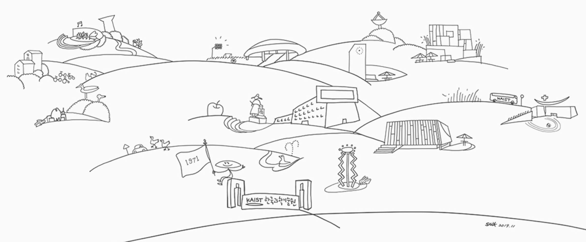

 
Welcome to the Yim Lab in the [Dept. of Biological Sciences at KAIST](https://bio.kaist.ac.kr).

Our lab explores the vast field of microbiology, encompassing vital areas such as human health, food production, and industrial biotechnology. We're dedicated to unraveling the genetic and microbial components influencing microbiome processes, with the ultimate goal of harnessing microorganisms as living sensors, therapeutics, and manufacturing platforms.

To achieve this, we are pioneering engineering design principles for a wide range of microbes and microbial communities. Our toolkit includes cutting-edge technologies such as high-throughput DNA synthesis and sequencing, multiplex phenotyping, systems and synthetic biology, animal models, and bioinformatics.

Join us on this exciting journey of microbiological discovery and innovation!
 
 
