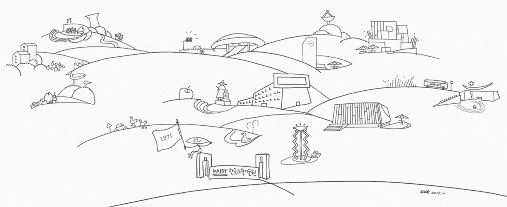

 
Welcome to the Yim Lab in the Graduate School of Engineering Biology at KAIST.

We study microbes and microbial communities that shape human health, food production, and industrial biotechnology. Our research aims to understand the genetic and ecological factors that govern how microbiomes function, and to use that understanding to engineer microorganisms as living sensors, therapeutics, and manufacturing platforms.

To this end, we develop engineering design principles for a broad range of microbes and microbial communities. Our work combines systems and synthetic biology with high-throughput DNA synthesis and sequencing, multiplex phenotyping, animal models, and bioinformatics.
 
