<table cellspacing="0" cellpadding="0">
  <tr>
    <td width="200">
      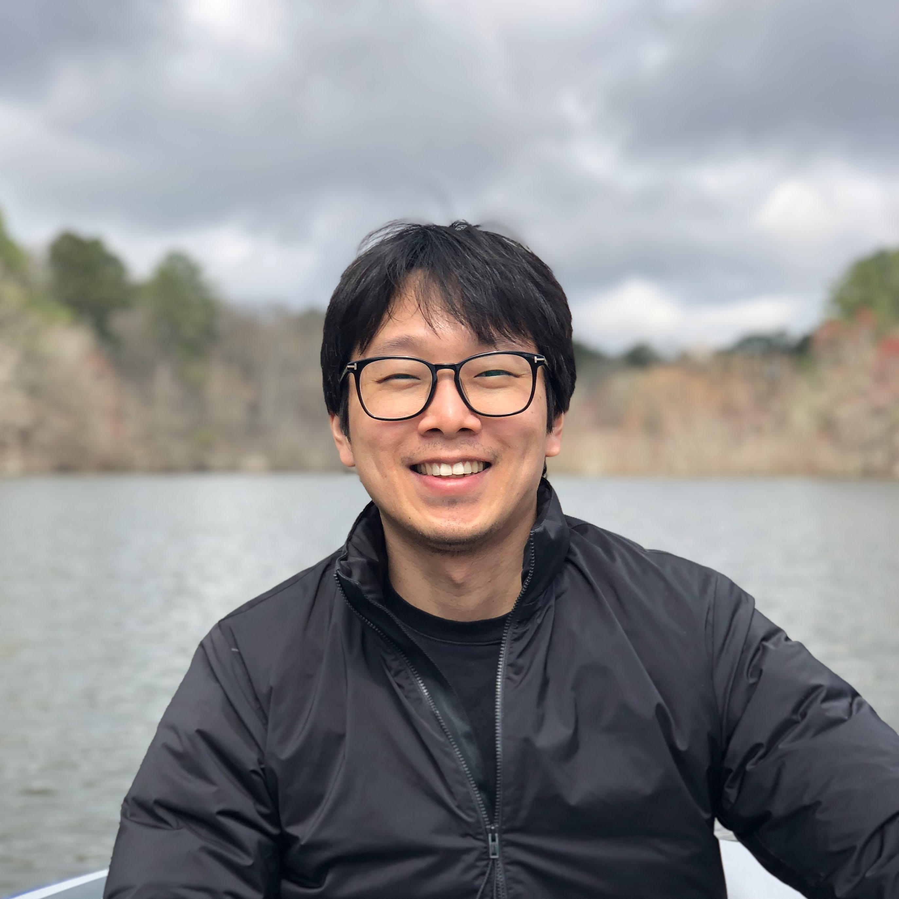
    </td>
    <td>
      

        <strong>Sung Sun Yim</strong> &ensp;
        <a href="../assets/pdf/CV_SungSunYim.pdf">cv</a>
      

      Assistant Professor, Biological Sciences, KAIST (2022-)
       sungsunyim@kaist.ac.kr
       
       Postdoc, Systems Biology, Columbia University, with
      <a href="https://wanglab.c2b2.columbia.edu">Harris H. Wang</a>
       Ph.D., Chemical and Biomolecular Engineering, KAIST, with
      <a href="http://proteineng.kaist.ac.kr/xe/">Ki Jun Jeong</a>  B.S.,
      Chemical and Biomolecular Engineering, KAIST
    </td>
  </tr>
</table>
 

<table cellspacing="0" cellpadding="0">
  <tr>
    <td width="200">
      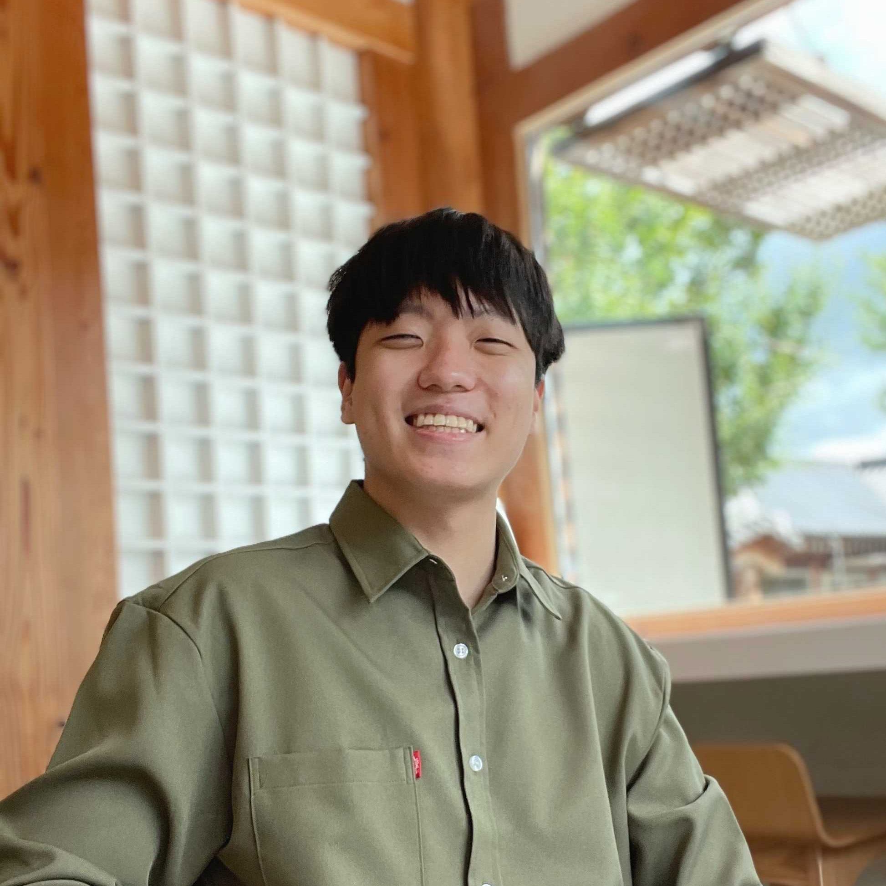
    </td>
    <td>
      
<strong>Changhee Won</strong>

      Graduate Student, Biological Sciences, KAIST (2022.9.-)
       wjc107@kaist.ac.kr
       
       B.S., Biotechnology, Korea University (2022.2.)
    </td>
  </tr>
</table>
 

<table cellspacing="0" cellpadding="0">
  <tr>
    <td width="200">
      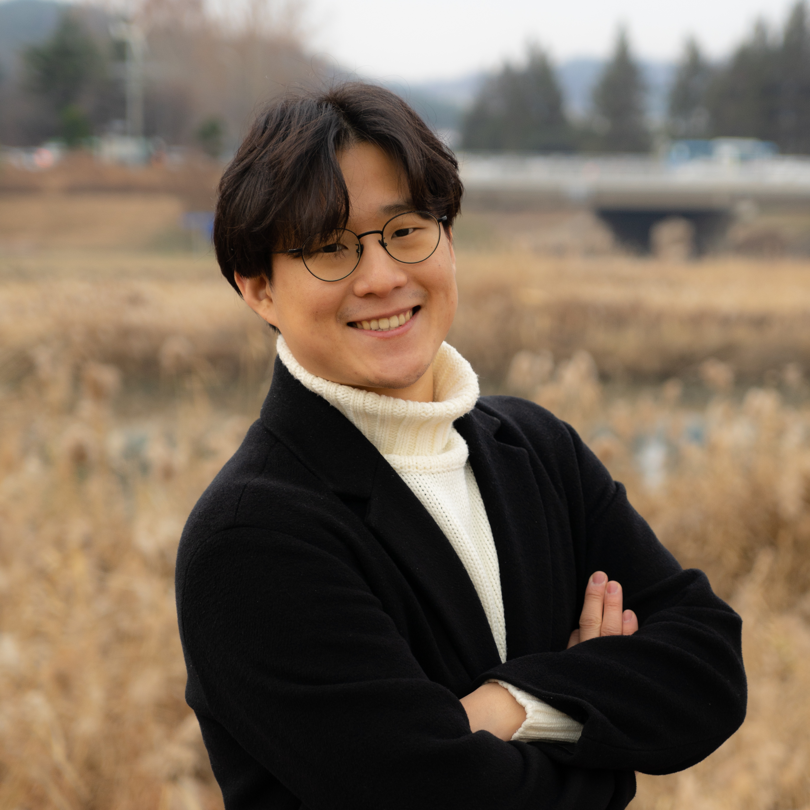
    </td>
    <td>
      
<strong>Dongha Lee</strong>

      Graduate Student, Biological Sciences, KAIST (2022.9.-)
       ahooha@kaist.ac.kr
       
       B.S., Genetic Engineering, Kyung Hee University (2022.2.)
    </td>
  </tr>
</table>
 

<table cellspacing="0" cellpadding="0">
  <tr>
    <td width="200">
      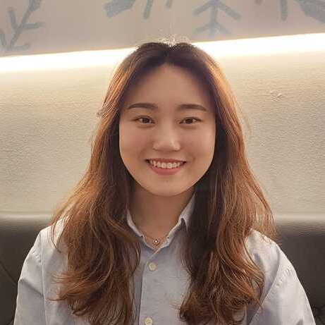
    </td>
    <td>
      
<strong>Hyeri Jang</strong>

      Graduate Student, Biological Sciences, KAIST (2023.3.-)
       hyerijang@kaist.ac.kr
       
       B.S., Biology, Kyungpook National University (2023.2.)
    </td>
  </tr>
</table>
 

<table cellspacing="0" cellpadding="0">
  <tr>
    <td width="200">
      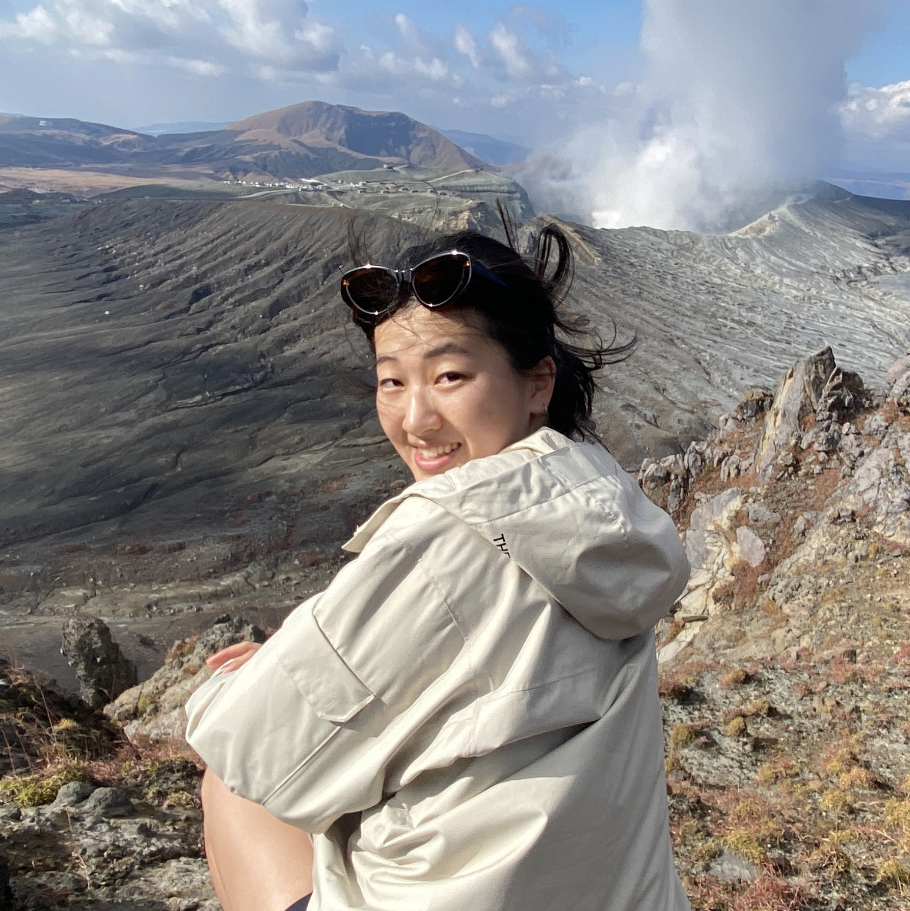
    </td>
    <td>
      
<strong>Geunhui Shin</strong>

      Graduate Student, Biological Sciences, KAIST (2023.3.-)
       geunhui.shin@kaist.ac.kr
       
       B.S., Transdisciplinary Studies, DGIST (2022.8.)
    </td>
  </tr>
</table>
 

<table cellspacing="0" cellpadding="0">
  <tr>
    <td width="200">
      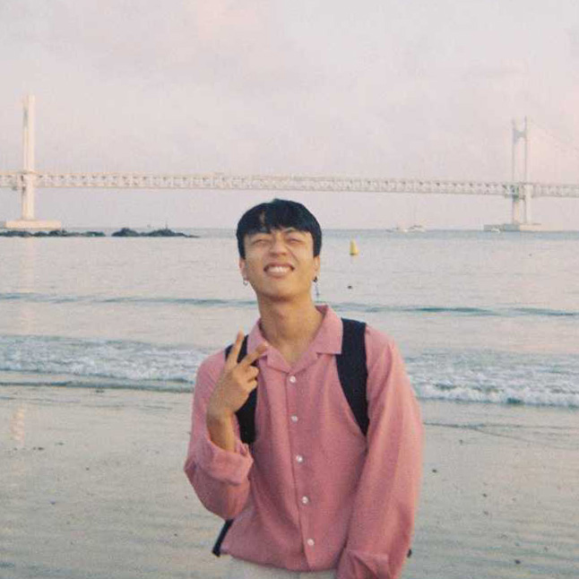
    </td>
    <td>
      
<strong>Eunseok Cho</strong>

      Graduate Student, Biological Sciences, KAIST (2024.3.-)
       eoxhdfud35@kaist.ac.kr
       
       B.S., Biological Sciences, KAIST (2022.2.)
    </td>
  </tr>
</table>
 

<table cellspacing="0" cellpadding="0">
  <tr>
    <td width="200">
      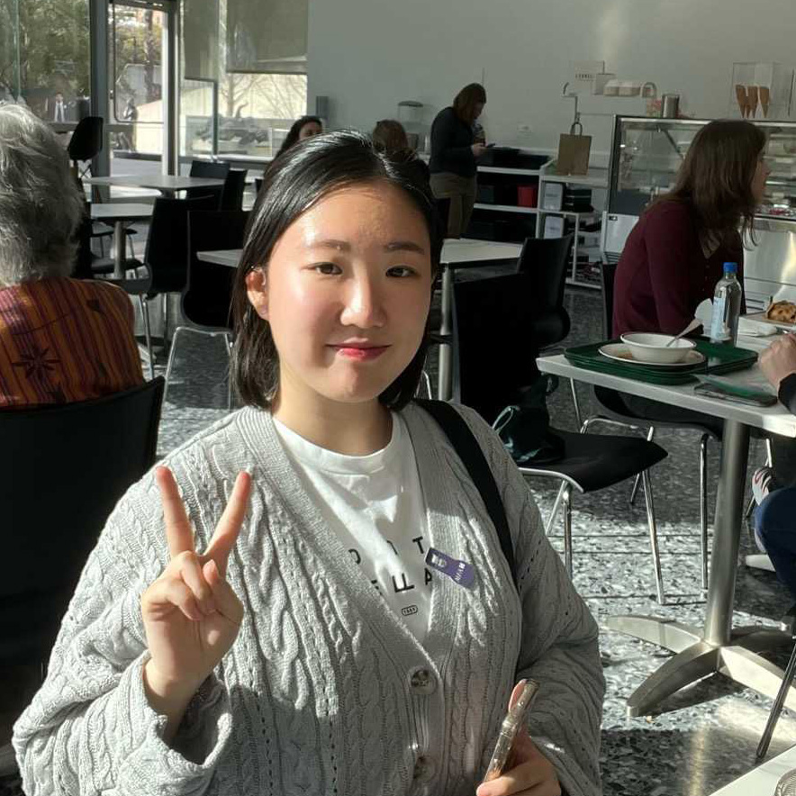
    </td>
    <td>
      
<strong>Sehyun Kim</strong>

      Graduate Student, Biological Sciences, KAIST (2024.3.-)
       ccodojunior@kaist.ac.kr
       
       B.S., Biological Sciences, KAIST (2024.2.)
    </td>
  </tr>
</table>
 

<table cellspacing="0" cellpadding="0">
  <tr>
    <td width="200">
      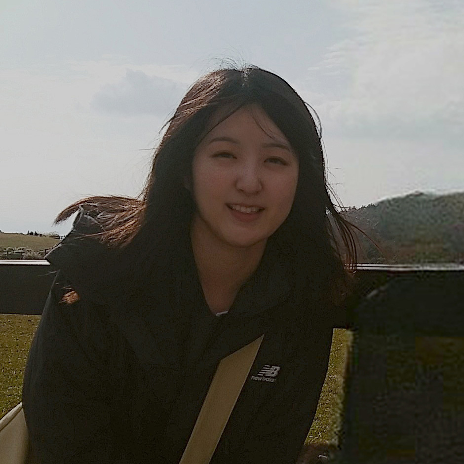
    </td>
    <td>
      
<strong>Hyorim Ryu</strong>

      Graduate Student, Biological Sciences, KAIST (2024.3.-)
       zzicgun@kaist.ac.kr
       
       B.S., Biological Sciences, Seoul National University (2023.8.)
    </td>
  </tr>
</table>
 

<table cellspacing="0" cellpadding="0">
  <tr>
    <td width="200">
      
    </td>
    <td>
      
<strong>Sang Hyun Chung</strong>

      Graduate Student, Engineering Biology, KAIST (2024.9.-)
       bio-csh99@kaist.ac.kr
       
       B.S., Systems Biotechnology, Chung-Ang University (2024.8.)
    </td>
  </tr>
</table>
 

<table cellspacing="0" cellpadding="0">
  <tr>
    <td width="200">
      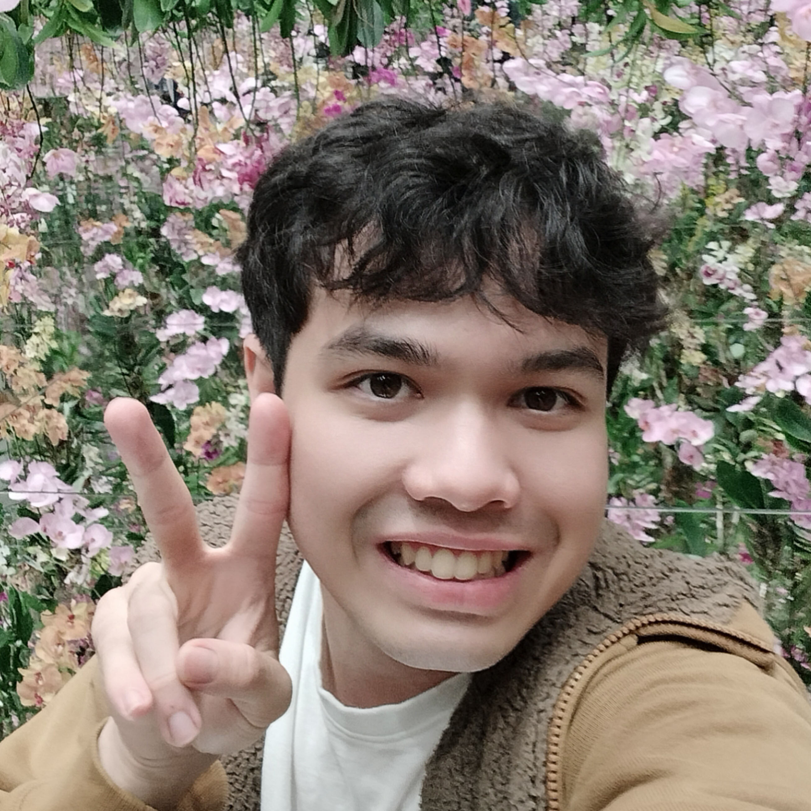
    </td>
    <td>
      
<strong>Thanakrit (Austin) Wongsatit</strong>

      Graduate Student, Engineering Biology, KAIST (2025.3.-)
       austinwongsatit@kaist.ac.kr
       
       B.S., Bio and Brain Engineering, KAIST (2024.2.)
    </td>
  </tr>
</table>
 

<table cellspacing="0" cellpadding="0">
  <tr>
    <td width="200">
      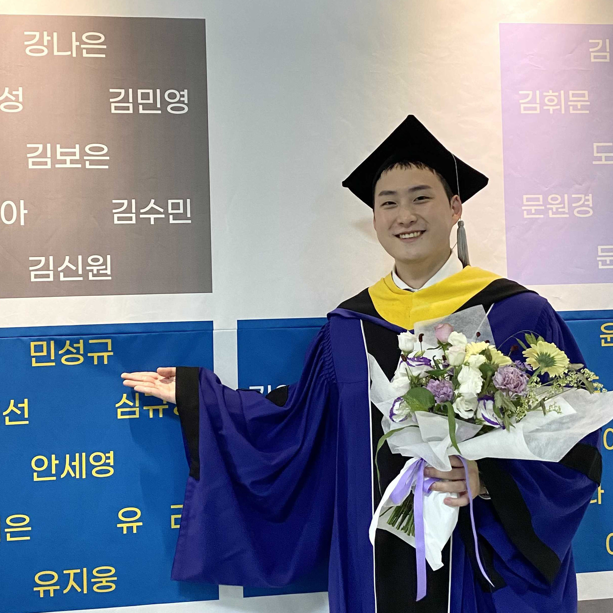
    </td>
    <td>
      
<strong>Sunggyu Min</strong>

      Graduate Student, Engineering Biology, KAIST (2025.3.-)
       msg_kaist@kaist.ac.kr
       
       M.S., Public Health, Seoul National University (2023.8.)  B.S.,
      Life Science, Korea University (2021.2.)
    </td>
  </tr>
</table>
 

<table cellspacing="0" cellpadding="0">
  <tr>
    <td width="200">
      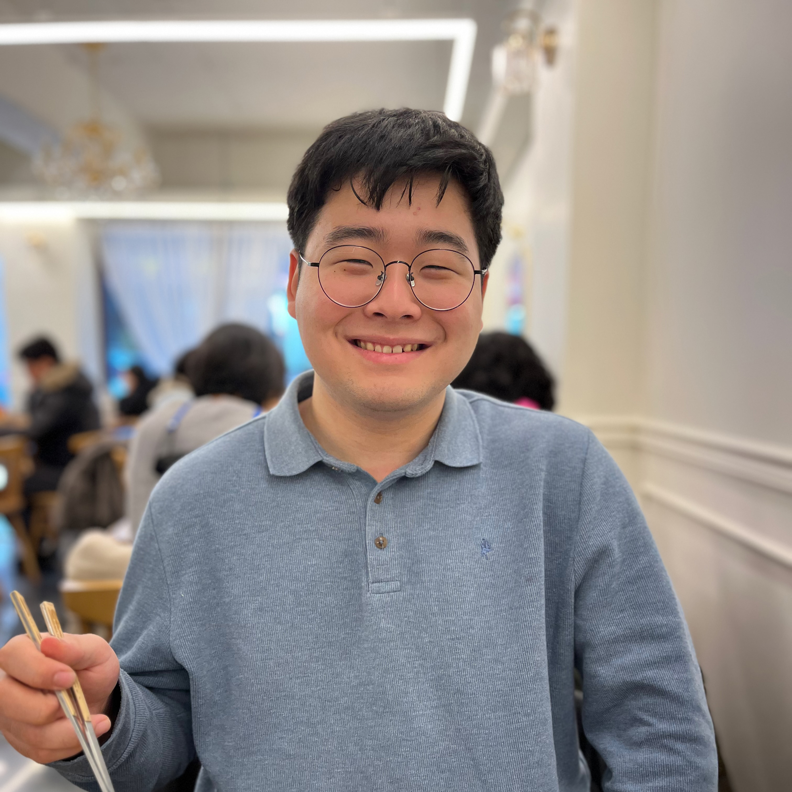
    </td>
    <td>
      
<strong>Min Hyeok Yang</strong>

      Undergraduate Student, Biological Sciences, KAIST (2022.12.-)
       ringyee@kaist.ac.kr
    </td>
  </tr>
</table>
 

<table cellspacing="0" cellpadding="0">
  <tr>
    <td width="200">
      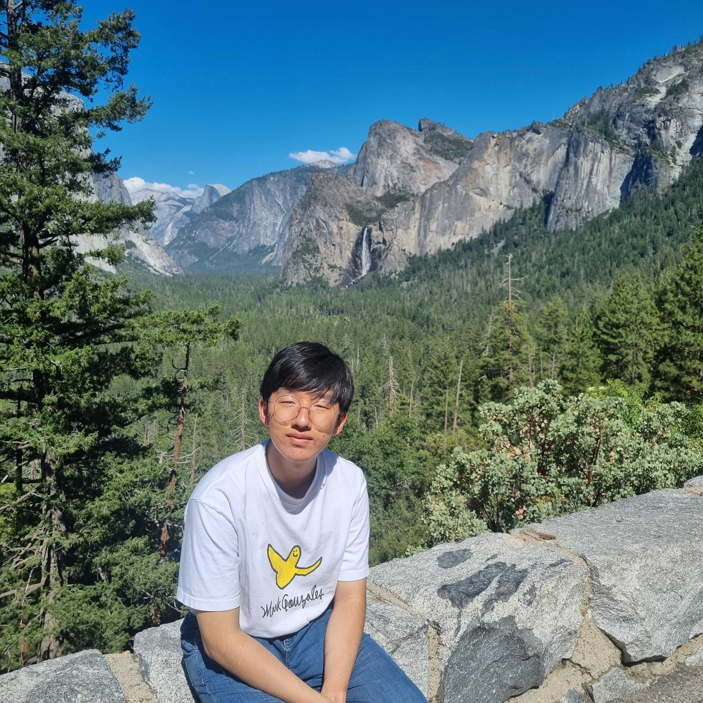
    </td>
    <td>
      
<strong>Minjoon Jeong</strong>

      Undergraduate Student, Biological Sciences, KAIST (2024.3.-)
       davidmj413@kaist.ac.kr
    </td>
  </tr>
</table>
 

<table cellspacing="0" cellpadding="0">
  <tr>
    <td width="200">
      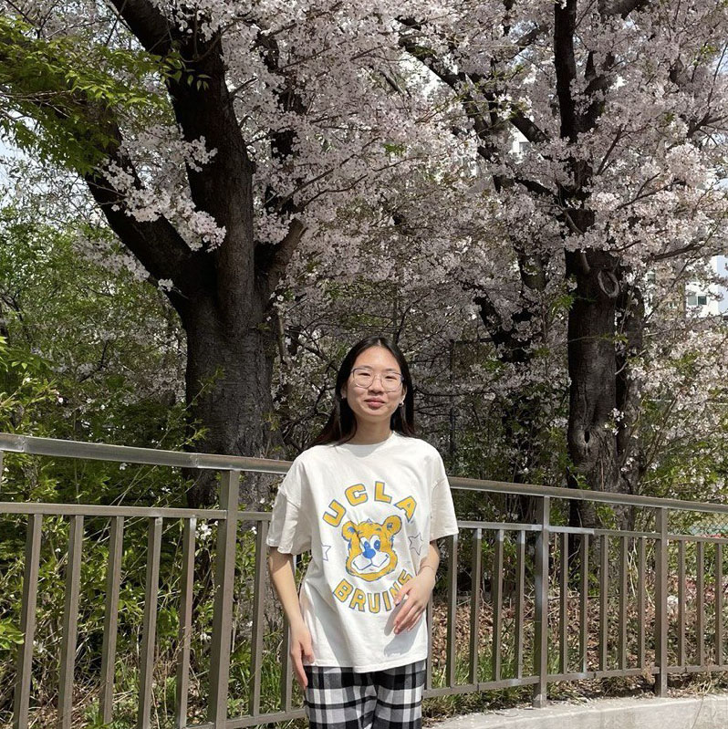
    </td>
    <td>
      
<strong>Yelena Kim</strong>

      High School Student, Korea Science Academy (2025.3.-)
       23-206@ksa.hs.kr
    </td>
  </tr>
</table>
 

<table cellspacing="0" cellpadding="0">
  <tr>
    <td width="200">
      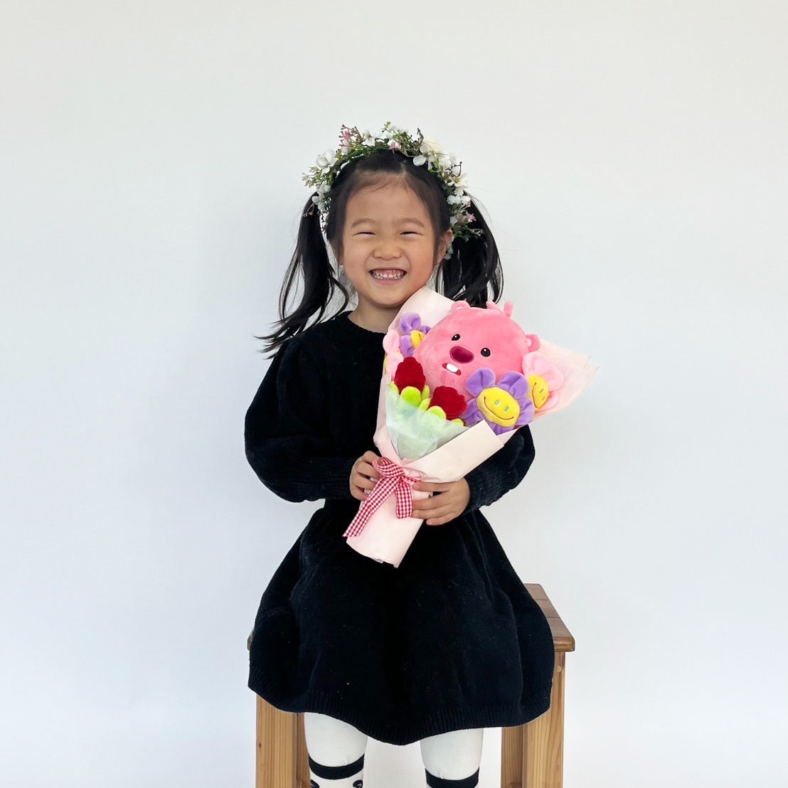
    </td>
    <td>
      
<strong>Hailey Yim</strong>

      Junior Volunteer (2020-)
       
       Aspiring Veterinarian  Current Interest: Paw Patrol, Wish Cat,
      and more
    </td>
  </tr>
</table>
 
