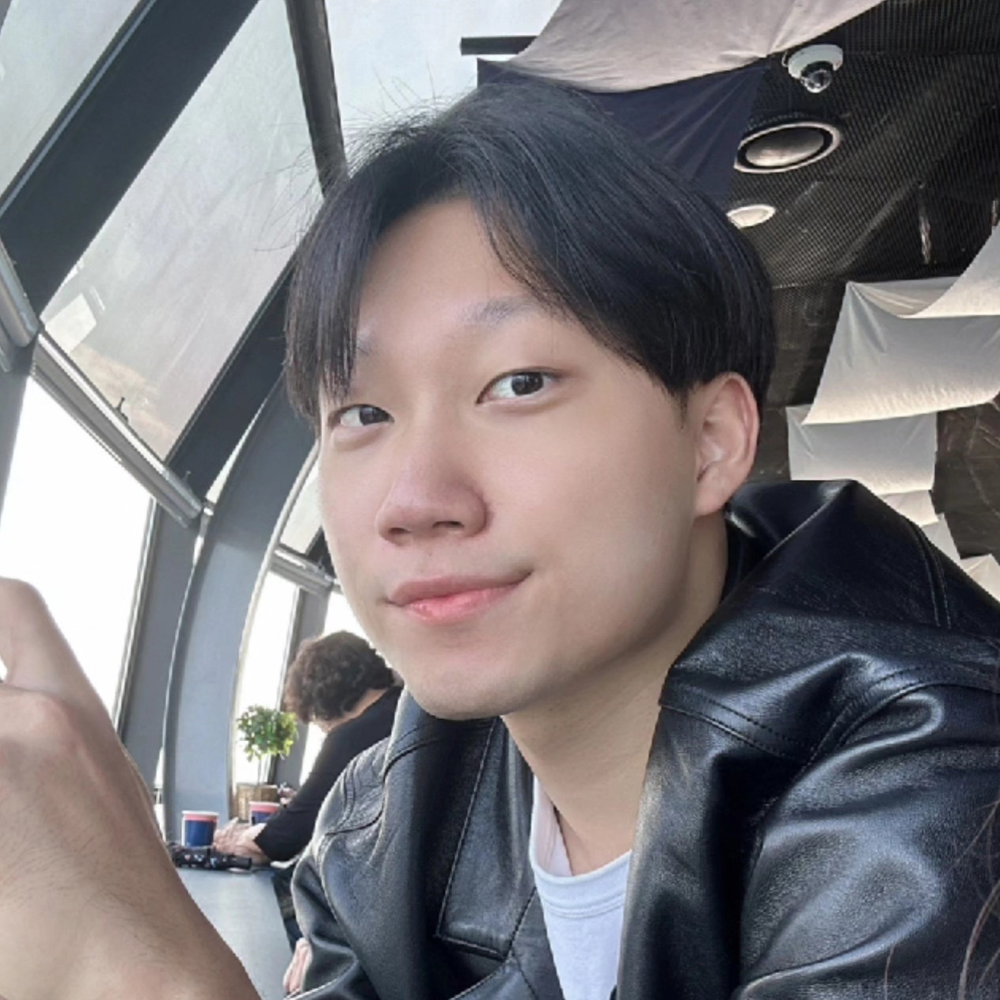

<table cellspacing="0" cellpadding="0">
<tr>
<td width="200">
  
</td>
<td>
  
<strong>Sung Sun Yim</strong> &ensp; <a href="../assets/pdf/CV_SungSunYim.pdf">cv</a>

  Assistant Professor, Biological Sciences, KAIST (2022-)
   sungsunyim@kaist.ac.kr
   
   Postdoc, Systems Biology, Columbia University, with <a href="https://wanglab.c2b2.columbia.edu">Harris H. Wang</a>
   Postdoc, Chemical and Biomolecular Engineering, KAIST, with <a href="http://proteineng.kaist.ac.kr/xe/">Ki Jun Jeong</a>
   Ph.D., Chemical and Biomolecular Engineering, KAIST, with <a href="http://proteineng.kaist.ac.kr/xe/">Ki Jun Jeong</a>
   B.S., Chemical and Biomolecular Engineering, KAIST
</td></tr>
</table>
 

<table cellspacing="0" cellpadding="0">
<tr>
<td width="200">
  
</td>
<td>
  
<strong>Changhee Won</strong>

  Graduate Student, Biological Sciences, KAIST (2022.9.-)
   wjc107@kaist.ac.kr
   
   B.S., Biotechnology, Korea University (2022.2.)
</td></tr>
</table>
 

<table cellspacing="0" cellpadding="0">
<tr>
<td width="200">
  
</td>
<td>
  
<strong>Dongha Lee</strong>

  Graduate Student, Biological Sciences, KAIST (2022.9.-)
   ahooha@kaist.ac.kr
   
   B.S., Genetic Engineering, Kyung Hee University (2022.2.)
</td></tr>
</table>
 

<table cellspacing="0" cellpadding="0">
<tr>
<td width="200">
  
</td>
<td>
  
<strong>Hyeri Jang</strong>

  Graduate Student, Biological Sciences, KAIST (2023.3.-)
   hyerijang@kaist.ac.kr
   
   B.S., Biology, Kyungpook National University (2023.2.)
</td></tr>
</table>
 

<table cellspacing="0" cellpadding="0">
<tr>
<td width="200">
  
</td>
<td>
  
<strong>Geunhui Shin</strong>

  Graduate Student, Biological Sciences, KAIST (2023.3.-)
   geunhui.shin@kaist.ac.kr
   
   B.S., Transdisciplinary Studies, DGIST (2022.8.)
</td></tr>
</table>
 

<table cellspacing="0" cellpadding="0">
<tr>
<td width="200">
  
</td>
<td>
  
<strong>Eunseok Cho</strong>

  Graduate Student, Biological Sciences, KAIST (2024.3.-)
   eoxhdfud35@kaist.ac.kr
   
   B.S., Biological Sciences, KAIST (2022.2.)
</td></tr>
</table>
 

<table cellspacing="0" cellpadding="0">
<tr>
<td width="200">
  
</td>
<td>
  
<strong>Sehyun Kim</strong>

  Graduate Student, Biological Sciences, KAIST (2024.3.-)
   ccodojunior@kaist.ac.kr
   
   B.S., Biological Sciences, KAIST (2024.2.)
  </td></tr>
</table>
 

<table cellspacing="0" cellpadding="0">
<tr>
<td width="200">
  
</td>
<td>
  
<strong>Hyolim Ryu</strong>

  Graduate Student, Biological Sciences, KAIST (2024.3.-)
   zzicgun@kaist.ac.kr
   
   B.S., Biological Sciences, Seoul National University (2023.8.)
  </td></tr>
</table>
 

<table cellspacing="0" cellpadding="0">
<tr>
<td width="200">
  
</td>
<td>
  
<strong>Min Hyeok Yang</strong>

  Undergraduate Student, Biological Sciences, KAIST (2022.12.-)
   ringyee@kaist.ac.kr
</td></tr>
</table>
 

<table cellspacing="0" cellpadding="0">
<tr>
<td width="200">
  
</td>
<td>
  
<strong>Sang Hyun Chung</strong>

  Undergraduate Student, Systems Biotechnology, Chung-Ang University (2024.1.-)
   pbmi1227@naver.com
</td></tr>
</table>
 

<table cellspacing="0" cellpadding="0">
<tr>
<td width="200">
  
</td>
<td>
  
<strong>Jinyul Lee, Taewoo Yoo, Sihu Park</strong>

  High School Students, Korea Science Academy of KAIST (2023.3.-)
   22-092@ksa.hs.kr, 22-075@ksa.hs.kr, 22-049@ksa.hs.kr
</td></tr>
</table>
 

<table cellspacing="0" cellpadding="0">
<tr>
<td width="200">
  
</td>
<td>
  
<strong>Hailey Yim</strong>

  Junior Volunteer (2020-)
   
   Prospective Palaeontologist
   Current Interest: Tyrannosaurus, Brachiosaurus, and Pteranodon to name a few..
</td></tr>
</table>
 
